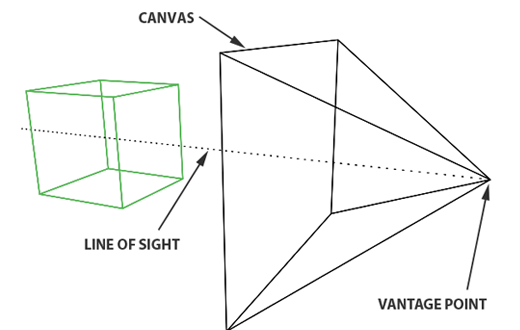
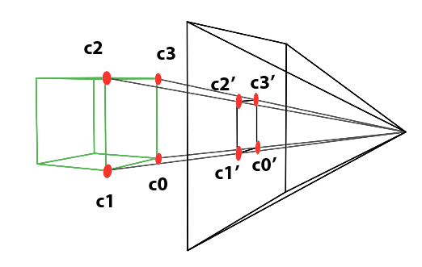
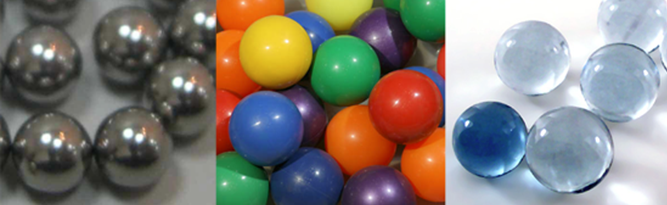
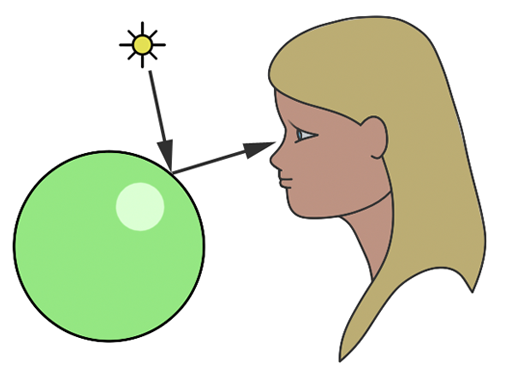

## ¿CÓMO SE CREA UNA IMAGEN?

Como se ve en la imagen, el renderizado de figuras 3D es como una proyección. Se toma la figura y se proyecta sobre un plano el cual forma una pirámide con lo que sería el ojo del espectador. El ojo del espectador sería esta punta de la pirámide que hace que el resto parezca como un lienzo. 

De esta forma se sustenta la creación de imágenes en diversos medios. O sea que este concepto tiene una aplicación universal en la representación visual.

## ¿CÓMO SE HACE LA PROYECCIÓN?

Esta proyección lo que hace es transformar objetos tridimensionales (x,y,z) a un plano bidimensional (x,y). Esto genera una ilusión de profundidad sobre el espectador en una superficie que en realidad es plana.

Por ejemplo, si un vértice del cubo se conecta con el ojo del espectador (aclaro que es el vértice de la esquina más a la derecha de la pirámide), el punto que pasa por el plano vendría siendo la proyección del mismo. Los vértices c0, c1, c2 y c3, y su proyección sobre el lienzo da lugar a los puntos c0', c1', c2' y c3'. Entonces, en nuestro plano se van a representar estos objetos en 3D como puntos proyectados.

## LUCES Y COLORES

El proceso de transformar una imagen tridimensional a una bidimensional consta de 2 etapas principales. La primera es lo que ya vimos, que sería el trazado del borde del objeto mediante la proyección. Ahora vamos a concentrarnos en la segunda etapa, la cual consiste en aplicarle color a estos contornos.

El color y el brillo de un objeto dependen de la forma en la que la luz interactúa con el material. La luz está cargada con fotones (partículas electromagnéticas) los cuales transportan energía y oscilan de forma similar a las ondas de sonido. Estas partículas pueden ser absorbidas, reflejadas o transmitidas por un objeto. Pero para todo esto hay que tener en cuenta un principio que aplica a todos los materiales: **la conservación del número de fotones**. La suma de fotones absorbidos, reflejados y transmitidos debe ser la misma que la cantidad inicial de fotones, garantizando así la conservación de la energía. 

### MATERIALES

Dentro de los materiales tenemos 2 categorías principales: los dieléctricos (que son aislantes eléctricos) y los conductores. Estos también pueden variar con respecto a la transparencia. Por último, otro detalle a tener en cuenta es que los materiales pueden estar compuestos por diversas capas, combinando las distintas cualidades de los mismos.

Esta mezcla de materiales aporta profundidad y realismo en la escena renderizada.

### PERCEPCION DEL COLOR

La percepción del color de un objeto bajo luz blanca (compuesta por fotones rojos, azules y verdes) viene determinada por qué fotones se absorben y cuáles se reflejan. 
Por ejemplo, un objeto rojo bajo luz blanca se percibe como rojo porque absorbe los fotones azules y verdes, mientras que refleja los rojos. La visibilidad del objeto se debe a que los fotones rojos reflejados llegan a nuestros ojos; cada punto de la superficie del objeto dispersa rayos de luz en todas direcciones, pero solo percibimos aquellos que inciden perpendicularmente en nuestros ojos, donde los fotorreceptores los transforman en señales neuronales. Estas señales son procesadas posteriormente por el cerebro, lo que nos permite distinguir diferentes colores y matices. 

---

**Referencias:** 
* [Scratchapixel: Introduction to Ray Tracing](https://www.scratchapixel.com/lessons/3d-basic-rendering/introduction-to-ray-tracing/how-does-it-work.html) 

> *Nota personal: Básicamente explico lo que dice ahí con mis palabras para entenderlo mejor e internalizar los conceptos que componen este proceso de renderización.*